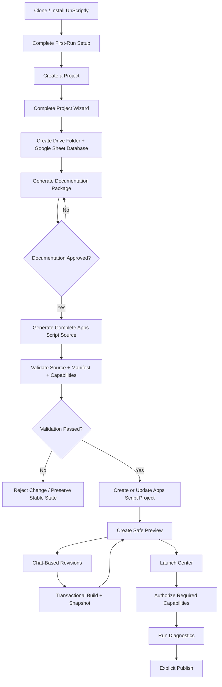
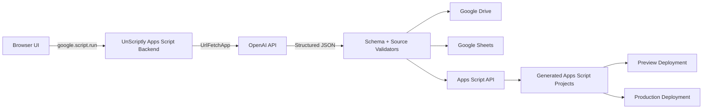

# UnScriptly™

**Build Google Apps Script web apps without living in the Apps Script editor.**

UnScriptly is a cloneable, no-code/low-code application builder for Google Workspace. It helps users describe an app, define its data and workflows, generate a complete implementation plan, create a Google Sheets-backed database, generate Apps Script source, preview changes safely, manage permissions, and publish the finished web app from a guided interface.

UnScriptly is designed around a simple idea: **Google Workspace can be a practical application platform—not just a collection of documents and spreadsheets.**

**Website:** https://www.unscriptly.com

> **Repository scope:** This repository contains the UnScriptly builder/core. The broader UnScriptly ecosystem may also include standalone Google Workspace tools, templates, and example applications.

---

## Table of Contents

- [What Is UnScriptly?](#what-is-unscriptly)
- [Why UnScriptly Exists](#why-unscriptly-exists)
- [Core Product Principles](#core-product-principles)
- [What UnScriptly Builds](#what-unscriptly-builds)
- [Key Features](#key-features)
- [How It Works](#how-it-works)
- [Architecture](#architecture)
- [Starter Templates](#starter-templates)
- [Generated App Baseline](#generated-app-baseline)
- [Project Memory and Chat History](#project-memory-and-chat-history)
- [Preview and Version Safety](#preview-and-version-safety)
- [Capabilities and Permissions](#capabilities-and-permissions)
- [Data Storage](#data-storage)
- [Security and Privacy](#security-and-privacy)
- [Requirements](#requirements)
- [Getting Started](#getting-started)
- [First-Run Setup](#first-run-setup)
- [Creating Your First App](#creating-your-first-app)
- [Repository Architecture](#repository-architecture)
- [Generated Project Structure](#generated-project-structure)
- [Development Model](#development-model)
- [Build Safety Contract](#build-safety-contract)
- [Troubleshooting](#troubleshooting)
- [V1 Scope and Limitations](#v1-scope-and-limitations)
- [Contributing](#contributing)
- [Security Reports](#security-reports)
- [License](#license)
- [Project Links](#project-links)

---

## What Is UnScriptly?

UnScriptly is a Google Apps Script web app that builds other Google Apps Script web apps.

Instead of starting with a blank script project and manually wiring HTML, server functions, Google Sheets, permissions, deployment settings, and error handling, a user starts with a guided project brief.

UnScriptly then helps turn that brief into a working application through a controlled workflow:

1. Define the app.
2. Define users, roles, data, pages, workflows, and capabilities.
3. Create the project's Google Drive folder.
4. Create and wire the app's Google Sheets database.
5. Generate a complete documentation package.
6. Review and approve the documentation.
7. Generate the complete Apps Script source package.
8. Validate the generated source.
9. Create or update the Apps Script project.
10. Preview the app safely.
11. Request changes through chat.
12. Review permission impacts.
13. Run launch checks.
14. Publish explicitly when ready.
15. Restore an earlier stable version if needed.

The normal workflow is intentionally designed to keep nontechnical users out of the Apps Script editor as much as possible.

---

## Why UnScriptly Exists

Building a lightweight internal tool should not always require a dedicated SaaS subscription, a custom hosting stack, or weeks of engineering work.

Google Workspace already provides many of the primitives small teams need:

- Google Sheets for structured data.
- Google Drive for files.
- Apps Script for server-side logic.
- HTML Service for web interfaces.
- Gmail/MailApp for notifications.
- Google Calendar for events.
- Google Slides for document/export workflows.
- Time-based triggers for automation.
- Google APIs for deployment and integration.

The difficult part is assembling those pieces into a coherent, secure, maintainable application.

UnScriptly is intended to make that assembly process guided, inspectable, repeatable, and recoverable.

---

## Core Product Principles

### 1. Your Google account is the runtime

UnScriptly runs primarily inside the user's Google environment. Generated apps, databases, files, deployments, snapshots, and configuration remain tied to resources the user controls.

### 2. Documentation before code

UnScriptly does not jump directly from a short prompt to production source code.

Before initial code generation, it creates a structured documentation package covering product requirements, technical architecture, information architecture, data schema, user flows, backend functions, UI components, permissions, files, and launch requirements.

The user reviews and approves that package before code generation begins.

### 3. Google Sheets is the default application database

Every generated V1 app receives a dedicated Google Sheet database.

Sheets is treated as application storage rather than as the user interface itself. Generated apps interact with the database through Apps Script services and present users with a purpose-built HTML interface.

### 4. AI output is untrusted until validated

OpenAI-generated content that affects saved application state must use structured output and pass validation before UnScriptly writes it to Drive, Sheets, snapshots, or an Apps Script project.

### 5. Every source update is transactional

UnScriptly does not apply chat-requested code changes directly to the last known-good source.

Changes are generated into staging, validated, previewed, and only then committed as a new stable snapshot.

### 6. Production publishing is explicit

Preview deployments may refresh automatically after approved milestones. Production is different: UnScriptly does not silently publish a change.

A user must explicitly choose to publish.

### 7. Permissions must be understandable

Adding email, Drive files, Slides, Calendar, scheduled triggers, or external APIs can change OAuth scope requirements.

UnScriptly is designed to explain that impact before applying capability changes.

---

## What UnScriptly Builds

V1 focuses exclusively on **Google Apps Script web apps**.

Typical use cases include:

- Internal dashboards
- Administrative portals
- Approval workflows
- Request intake systems
- Training and sign-off portals
- Record-management applications
- Lightweight CRMs
- Operational trackers
- Client or member portals
- Reporting tools
- File-based workflows
- Email-enabled workflows
- Calendar-enabled workflows
- Scheduled automation tools

V1 is not intended to generate native mobile apps, Chrome extensions, Google Workspace add-ons, or externally hosted React/Node applications.

---

## Key Features

### Guided first-run setup

The setup wizard configures the local UnScriptly installation and verifies that required Google services are available.

Setup includes:

- OpenAI API key
- Owner/admin email
- Default support email
- Root Google Drive folder
- Default AI model
- Branding defaults
- Apps Script API readiness
- Google authorization readiness

The OpenAI API key must remain server-side.

### Multi-project dashboard

One UnScriptly installation can manage multiple generated projects.

A project record can track:

- Project name and status
- Drive folder
- Database Sheet
- Apps Script project ID
- Preview deployment
- Production deployment
- Portal URL
- Current source snapshot
- Documentation version
- Capability plan
- Schema version
- Build history
- Conversation history

### Project wizard

The project wizard captures the information needed to create a coherent application rather than relying on a single vague prompt.

It can collect:

- App name
- Starter template
- Purpose
- Target users
- User roles
- Core workflows
- Data objects
- Required pages
- Branding
- Support settings
- Capabilities
- Time zone
- Database preferences
- Launch settings

### Documentation-first generation

Before code generation, UnScriptly creates a documentation package that can include:

- Product Requirements Document
- Technical Requirements Document
- Implementation Plan
- Information Architecture
- Data Model / Schema Specification
- Backend Function Map
- User Flow Specification
- UI Component Specification
- File Manifest
- Capability / Permission Plan
- Launch Checklist

Code generation is gated by documentation approval.

### Automatic database wiring

Each generated app receives a dedicated Google Sheet database before source generation.

UnScriptly can:

- Create baseline system tabs
- Create app-specific business tabs
- Apply schema definitions
- Generate sample data
- Validate sample data against the schema
- Store the database ID in server-side generated configuration
- Plan and back up risky schema migrations

### Chat-first builder

After initial generation, users can request changes conversationally.

The builder is designed to:

- Lock concurrent edits while a build is active
- Record the triggering request
- Build a canonical prompt context packet
- Generate a structured change plan
- Apply changes to staging
- Validate the complete source package
- Refresh the design preview
- Commit only after validation succeeds
- Roll back on failure

### Split-screen preview workspace

The builder combines chat with a right-side project panel.

Planned right-panel views include:

- Preview
- Files
- Database
- Launch Center
- Capabilities
- Logs
- Manifest
- Snapshots
- Project Memory

### Responsive preview frames

Preview generated apps in:

- Desktop
- Tablet
- Mobile

The preview environment can also simulate:

- Admin
- Manager
- User
- Guest / Request Access

Role simulation is limited to protected preview mode and must not weaken production authorization.

### Safe Mode preview

Preview mode is visually distinct from production and uses a visible **Safe Mode** indicator.

Live preview embedding is protected by short-lived preview tokens.

### Version history

Every stable source state can be represented by a snapshot.

Users can:

- Inspect stable versions
- Compare recent changes
- Stop and revert an in-progress change
- Restore an older stable version
- Preserve restore history rather than deleting newer history

A restore creates a new snapshot representing the restored state.

### Launch Center

The Launch Center brings deployment readiness into the product UI.

It can track:

- Required Google authorization
- Capability setup
- Capability tests
- Diagnostics
- Preview deployment
- Production deployment
- Portal URL
- Support email
- Launch warnings
- Publish readiness

---

## How It Works



---

## Architecture

UnScriptly is designed as a Google-hosted control plane around Apps Script, Drive, Sheets, and the Apps Script API.



### Primary runtime

- Google Apps Script
- HTML Service
- `google.script.run`

### Primary storage

- Google Sheets
- Google Drive
- Apps Script Properties for installation-level secrets/configuration

### AI layer

- OpenAI API
- Structured Outputs / JSON Schema
- Saved prompt context packets
- Validation before mutation

### Google platform integration

- Google Drive
- Google Sheets
- Apps Script API
- Apps Script deployments
- Apps Script execution API where supported
- Optional capability APIs through generated apps

---

## Starter Templates

UnScriptly V1 includes three starter blueprints plus the ability to define a custom build.

### Data Dashboard

For apps centered on records, tables, metrics, filtering, charts, and administrative data management.

Typical generated pages:

- Login
- Dashboard
- Records
- Record detail
- Add/edit record
- Reports
- Settings
- Admin
- Launch Center

### Approval Portal

For request, review, decision, and status workflows.

Typical generated capabilities:

- Request submission
- Reviewer queue
- Approval/rejection
- Status history
- Notifications
- Administrative controls

### Training & Sign-off Portal

For training assignment, completion, acknowledgement, and sign-off workflows.

Typical generated capabilities:

- Training modules
- Assignments
- Completion tracking
- Sign-offs
- Receipt/history records
- Administrative controls

---

## Generated App Baseline

Every generated application is expected to include a baseline operational layer, not just the feature-specific pages requested by the user.

The V1 baseline includes:

- `doGet(e)` web app entry
- Router
- Login/access gate
- User and role management
- Admin dashboard
- Settings
- Google Sheets database service
- Sessions
- Audit log
- System log
- Capability status
- Launch Center
- Diagnostics
- Error handling
- Preview mode
- Preview token validation
- Safe Mode indicator
- Support email setting
- Portal URL setting
- Source version setting

This baseline gives generated apps a consistent operational foundation.

---

## Project Memory and Chat History

UnScriptly does not rely on an AI model to remember the project from one request to the next.

Each project maintains its own durable context.

### Stored context can include

- Full raw project chat history
- Project purpose
- Target users
- Roles
- Requirements
- Decisions
- Rejected or deferred ideas
- Approved documentation
- Current schema
- Capability plan
- Current stable source snapshot
- Open questions
- Known risks
- Build runs
- AI call logs
- Prompt context packets
- Version checkpoints

### Source-of-truth hierarchy

When context conflicts, UnScriptly is designed to prioritize:

1. The user's explicit current request
2. Approved project documentation
3. Active project decisions
4. Active requirements records
5. Current stable source snapshot
6. Current database schema
7. Current capability plan
8. Current project memory summary
9. Recent raw chat
10. Older raw chat and historical summaries

If a new request conflicts with critical approved state, UnScriptly should surface the conflict instead of silently rewriting the project.

### Why this matters

Without durable project memory, chat-based code generation can drift over time.

A project memory layer makes it possible to answer questions such as:

- Why was this feature added?
- Which request caused this source change?
- Which schema version did this build use?
- What capabilities were active when this version shipped?
- Which AI call produced this file set?
- What state should be restored when reverting?

---

## Preview and Version Safety

Apps Script project updates require special care because updating project content through the Apps Script API replaces the submitted project file set.

For that reason, **UnScriptly never treats a generated code edit as a one-file patch**.

### Full-source replacement rule

Every source push must contain the complete generated Apps Script project:

- Required baseline files
- Template-specific files
- Active capability files
- The Apps Script manifest

If one file changes, UnScriptly still validates and pushes a complete package.

### Transactional build flow

```text
Acquire build lock
        ↓
Copy last stable state to staging
        ↓
Build AI prompt context
        ↓
Generate structured change
        ↓
Validate complete file package
        ↓
Apply safe changes to staging
        ↓
Refresh preview
        ↓
Commit new stable snapshot
        ↓
Release build lock
```

If validation fails, the last stable state remains authoritative.

### Stop & Revert

Stop & Revert is intended for the current in-progress build only.

It can:

- Mark the active build as cancelled
- Discard staging changes
- Restore the previous stable UI state
- Push the previous complete source package if rollback is required
- Release the build lock

### Version restore

Restoring an older version does not erase history.

The restored state becomes a new snapshot so the audit trail remains intact.

---

## Capabilities and Permissions

Generated apps may need access to additional Google services.

UnScriptly models these as explicit **capabilities**.

Initial V1 capability categories include:

| Capability | Typical Purpose |
|---|---|
| Sheets Database | Core generated app storage |
| Email | Notifications and workflow messages |
| Drive Files | Uploads, attachments, generated files |
| Slides Export | Presentation/document generation |
| Calendar | Event creation and scheduling |
| Scheduled Triggers | Recurring jobs and automation |
| External API | Third-party integrations |
| Apps Script API | Project creation, source updates, deployments, diagnostics |

A capability plan should define:

- Why the capability is needed
- Required generated files
- Required OAuth scopes
- Setup function
- Test function
- Authorization status
- Whether reauthorization is required
- Risk level

UnScriptly must not bypass Google OAuth consent. When Google requires authorization, the product should explain why and guide the user through the legitimate flow.

---

## Data Storage

UnScriptly uses the user's Google environment as the primary storage layer.

### UnScriptly installation data

The master database can track:

- Projects
- Project status
- Generated resources
- Build runs
- Snapshots
- Capabilities
- Deployments
- Preview tokens
- Conversations
- Chat messages
- Requirements
- Decisions
- Prompt context packets
- AI call records

### Per-project resources

Each generated project receives:

- A dedicated Google Drive folder
- A dedicated Google Sheet database
- Generated documentation
- Source snapshots
- Generated source files
- Deployment metadata

### Generated application data

Generated apps use their dedicated Google Sheet as the default V1 database.

The application UI should read and write through Apps Script services rather than asking end users to manipulate database rows directly.

---

## Security and Privacy

Security is part of the build contract, not an optional post-launch step.

### OpenAI API key

The OpenAI API key must:

- Be stored server-side
- Never be embedded in HTML
- Never be returned through client configuration
- Never be written to generated frontend files
- Never be included in exports intended for users

### Preview security

Preview mode must:

- Require a valid short-lived token for protected embedding
- Visibly indicate Safe Mode
- Permit role simulation only inside protected preview
- Keep production authorization behavior separate
- Ignore preview role overrides in production

### Source safety

Before generated source is committed, UnScriptly validates:

- Complete file package
- Manifest presence
- Required web app entry
- Baseline files
- Database wiring
- Preview protection
- Capability alignment
- OAuth scope alignment
- Unresolved placeholders
- Secret leakage into client files

### Database changes

Potentially destructive schema changes should require:

- A migration plan
- Risk classification
- Backup
- Explicit approval
- Rollback instructions

### AI logs and project context

Project context and AI debugging logs can contain sensitive application information.

When enabled, these records should remain in user-controlled storage and should support appropriate export/delete controls.

### Third-party processing

UnScriptly itself is designed to run in the user's Google environment. However, prompts sent through the user's configured OpenAI API key are processed by OpenAI according to the terms and settings of that API account.

Do not place secrets or sensitive data into project prompts unless that information is genuinely required for the build.

---

## Requirements

To use the UnScriptly builder, you will generally need:

- A Google account with access to Google Drive, Google Sheets, and Google Apps Script
- Permission to authorize the Apps Script scopes required by UnScriptly
- An OpenAI API key
- Apps Script API access enabled for the Google Cloud project used by the installation
- A modern browser

Some generated capabilities may require additional authorization or third-party API credentials.

---

## Getting Started

### Recommended end-user installation

Use the official UnScriptly distribution flow from:

https://www.unscriptly.com

The intended installation model is a user-owned copy running inside that user's Google environment.

Because Google Apps Script authorization and deployment behavior can change, follow the current setup instructions shipped with the repository or official distribution package.

### Using this repository as source

This repository is the development source for the UnScriptly builder.

Google Apps Script does not execute directly from GitHub. To run the source, it must be associated with an Apps Script project.

Depending on the repository workflow, you can:

- Copy the source files into an Apps Script project, or
- Use Google's `clasp` tooling to synchronize a local checkout with Apps Script

A typical `clasp` development flow looks like:

```bash
npm install -g @google/clasp
clasp login
clasp clone YOUR_SCRIPT_ID
clasp push
```

Use your own Apps Script project ID. Never commit private script IDs, OAuth secrets, API keys, or other credentials unless they are explicitly intended to be public.

---

## First-Run Setup

When a fresh installation opens, UnScriptly should route to the setup wizard.

### 1. Add your OpenAI API key

The key is stored server-side for AI generation requests.

Do not place the key directly in `Index.html`, `Client.html`, query parameters, browser storage, or generated application code.

### 2. Set the owner/admin identity

Provide the email address that will act as the primary administrator for the UnScriptly installation.

### 3. Configure support defaults

Set the default support email and optional branding defaults used when new apps are created.

### 4. Create or select the root Drive folder

UnScriptly uses this folder as the top-level location for generated project resources.

### 5. Create the master database

The master Google Sheet stores the UnScriptly installation's project records and build metadata.

### 6. Run readiness checks

Prechecks should verify access to:

- Script Properties
- Google Drive
- Google Sheets
- OpenAI API
- Apps Script API
- Required authorization scopes

Resolve any failed precheck before relying on automated project creation or deployment.

---

## Creating Your First App

### Step 1 — Create a project

Open the project dashboard and choose **New App**.

### Step 2 — Choose a template

Start with:

- Data Dashboard
- Approval Portal
- Training & Sign-off Portal
- Custom/blank configuration where available

### Step 3 — Complete the project brief

Define:

- Purpose
- Users
- Roles
- Workflows
- Data
- Pages
- Branding
- Capabilities
- Launch settings

### Step 4 — Create project storage

UnScriptly creates the project Drive folder and Google Sheet database.

### Step 5 — Review sample data

Sample data should match the generated schema and the concept of the app without introducing unnecessary sensitive personal information.

### Step 6 — Review documentation

Read the generated product and technical documentation.

Resolve blocking questions and approve the documentation before code generation.

### Step 7 — Generate source

UnScriptly creates a complete Apps Script source package and validates it against the generated app contract.

### Step 8 — Preview

Inspect the app in desktop, tablet, and mobile frames.

Use preview roles to check intended experiences without weakening production access rules.

### Step 9 — Request changes

Describe changes in chat.

UnScriptly records the request, locks the active build, generates the change into staging, validates it, and commits it only when the build passes.

### Step 10 — Review capabilities

If the change adds a permission-sensitive capability, review the impact before continuing.

### Step 11 — Run Launch Center

Complete required authorization, setup, tests, and diagnostics.

### Step 12 — Publish

Publish only when the production checklist is ready.

---

## Repository Architecture

The canonical V1 source architecture is service-oriented.

The exact file count may change as implementation evolves, but the responsibilities below should remain separated.

```text
UnScriptly/
├── appsscript.json
├── Code.gs
├── Config.gs
├── Router.gs
│
├── SetupService.gs
├── SettingsService.gs
├── PrecheckService.gs
│
├── OpenAIService.gs
├── PromptLibrary.gs
├── SchemaRegistry.gs
├── StructuredOutputValidationService.gs
├── GenerationReviewService.gs
│
├── DriveService.gs
├── SheetService.gs
├── MasterDbService.gs
├── GeneratedDbService.gs
├── DatabaseWiringService.gs
├── SampleDataService.gs
├── SchemaMigrationService.gs
│
├── ProjectService.gs
├── ProjectWizardService.gs
├── TemplateRegistryService.gs
├── TemplateBlueprints.gs
│
├── DocumentationService.gs
├── FileManifestService.gs
├── SourceGenerationService.gs
├── FileValidationService.gs
├── GeneratedAppContractService.gs
│
├── SnapshotService.gs
├── StagingSnapshotService.gs
├── BuildLockService.gs
├── TransactionalBuildService.gs
├── RollbackService.gs
├── VersionHistoryService.gs
│
├── CapabilityRegistryService.gs
├── AuthorizationPlannerService.gs
├── ManifestScopeService.gs
├── CapabilityDiagnosticsService.gs
├── LaunchCenterService.gs
│
├── AppsScriptApiService.gs
├── DeploymentService.gs
├── ExecutionApiService.gs
├── PreviewDeploymentService.gs
│
├── PreviewRendererService.gs
├── PreviewStateService.gs
├── PreviewTokenService.gs
├── DevicePreviewService.gs
│
├── ConversationService.gs
├── ChatMessageService.gs
├── ProjectMemoryService.gs
├── ContextSummaryService.gs
├── DecisionLogService.gs
├── RequirementsLedgerService.gs
├── PromptContextPacketService.gs
├── PromptContextBuilderService.gs
├── AICallLogService.gs
├── ContextQualityService.gs
├── MemoryCorrectionService.gs
├── ProjectStateCheckpointService.gs
│
├── AuditService.gs
├── SystemLogService.gs
├── QaTestService.gs
├── ErrorService.gs
│
├── Index.html
├── Styles.html
├── Client.html
├── Components.html
├── Setup.html
├── Dashboard.html
├── ProjectWizard.html
├── DocumentationReview.html
├── Builder.html
├── PreviewPanel.html
├── FilesPanel.html
├── DatabasePanel.html
├── LaunchCenter.html
├── CapabilitiesPanel.html
├── LogsPanel.html
├── ManifestPanel.html
├── SnapshotsPanel.html
├── ProjectMemoryPanel.html
└── Modals.html
```

---

## Generated Project Structure

Generated Apps Script projects use a separate source manifest from the UnScriptly builder itself.

A typical generated app contains baseline files similar to:

```text
Generated App/
├── appsscript
├── Code
├── Config
├── Router
├── AuthService
├── UserService
├── DatabaseService
├── SettingsService
├── AdminService
├── AuditService
├── SystemLogService
├── LaunchCenterService
├── CapabilityService
├── DiagnosticsService
├── PreviewService
├── ErrorService
├── Index
├── Styles
├── Client
├── Components
├── Login
├── Admin
├── LaunchCenter
└── PreviewBanner
```

Template-specific and capability-specific files are added to this baseline when required.

### Example capability files

**Email**

```text
NotificationService
EmailTemplateService
MailCapabilityTest
EmailTemplates
```

**Drive uploads/files**

```text
DriveFileService
UploadService
DriveCapabilityTest
```

**Scheduled automation**

```text
TriggerService
JobService
TriggerCapabilityTest
```

**External APIs**

```text
ExternalApiService
ExternalApiConfigService
ExternalApiCapabilityTest
```

---

## Development Model

UnScriptly uses AI generation as part of an application build system, not as an uncontrolled text-completion layer.

### Structured output types

The builder should maintain schemas for at least:

- Documentation packages
- Database schema plans
- Sample data
- Capability impact plans
- Complete source packages
- Change requests
- Schema migrations
- QA reviews

### Prompt context

Every state-changing AI request should include the canonical project context required to produce a consistent result.

That context can include:

- Project brief
- Approved documentation
- Active decisions
- Active requirements
- Current file manifest
- Current source state
- Database schema
- Project folder and database identifiers
- Capability plan
- Preview/security rules
- User request
- Required output schema

### Validation

AI output is accepted only after relevant checks pass.

A source package should be rejected when, for example:

- JSON is invalid
- Required schema fields are missing
- The manifest is missing
- `doGet(e)` is missing
- Required baseline files are missing
- Database IDs are incorrectly exposed
- Preview protection is missing
- Client files contain an API key
- Capability files and scopes do not match
- Required placeholders remain unresolved

---

## Build Safety Contract

The following rules are non-negotiable for state-changing builds:

1. Use structured outputs for AI responses that affect saved state.
2. Validate AI output before writing it to project storage.
3. Never send a partial source package to the Apps Script API.
4. Preserve a last stable snapshot.
5. Generate changes in staging before committing.
6. Lock chat while a build is active.
7. Stop & Revert discards only the current staging change.
8. Require explicit user action to update production.
9. Allow preview deployment to refresh separately from production.
10. Back up data before destructive schema changes.
11. Require explicit approval for destructive migrations.
12. Restrict role overrides to token-protected preview mode.
13. Never send the OpenAI API key to client HTML.

---

## Troubleshooting

### Apps Script API is disabled or returns `403`

The Google Cloud project associated with the UnScriptly installation may not have the Apps Script API enabled.

Enable the Apps Script API for the correct Cloud project, then rerun UnScriptly's precheck.

If you have multiple Google Cloud projects, confirm that you enabled the API on the project actually associated with the Apps Script installation.

### Google asks for authorization

This is expected when UnScriptly or a generated app needs access to Google services.

Review the requested permissions carefully and continue only if they match the capabilities you intend to use.

UnScriptly is not designed to bypass Google's authorization system.

### A required server function is "not found"

If the browser reports that a newly added Apps Script function does not exist, the deployed web app version may be older than the saved backend source.

Save the backend changes and update/redeploy the web app version, then reload the application.

### OpenAI request fails

Check:

- API key validity
- API account access
- Billing/usage state
- Model configuration
- Requested structured-output schema
- UrlFetch authorization
- UnScriptly AI call logs

A failed or invalid AI response should not be committed to the project.

### Structured output fails validation

UnScriptly should preserve the last stable state and log the validation error.

Review:

- Raw AI response
- JSON schema
- Missing required keys
- Invalid enum values
- Missing files
- Source validation results

### Preview will not load

Check:

- Preview deployment status
- Preview URL
- Preview token validity/expiration
- Deployment access settings
- Browser iframe restrictions
- Apps Script deployment errors

Do not weaken production security merely to make preview embedding work.

### A build is stuck

Inspect the active build run and lock.

A robust recovery flow should determine whether:

- The AI request is still unresolved
- Validation failed
- Source push failed
- Rollback is required
- The stale build lock can be safely released

Never delete the last stable snapshot as a recovery shortcut.

### Database migration is blocked

This is intentional when UnScriptly determines that a migration could rename, remove, overwrite, or reinterpret existing data.

Review the migration plan, backup, mapping requirements, and rollback plan before approving the change.

---

## V1 Scope and Limitations

UnScriptly V1 is intentionally focused.

### Included

- Google Apps Script web apps
- Google Sheets databases
- Google Drive project storage
- OpenAI-assisted documentation and source generation
- Multi-project dashboard
- Documentation approval
- Transactional changes
- Safe previews
- Version history
- Capability planning
- Authorization guidance
- Preview and production deployments
- Generated app diagnostics
- Project memory and raw chat history

### Not a V1 goal

- Native iOS or Android app generation
- Chrome extension generation
- Google Workspace add-ons
- Firebase or Supabase as required infrastructure
- External hosting as a requirement
- Enterprise SAML
- Automatic creation of every possible OAuth configuration
- Bypassing Google consent screens
- Guaranteed compatibility with every third-party API

---

## Contributing

Contributions that improve reliability, clarity, security, usability, or Apps Script compatibility are welcome when they remain aligned with the project's architecture.

### Before opening a pull request

Please:

1. Keep secrets out of source control.
2. Preserve the full-source replacement rule.
3. Preserve preview/production separation.
4. Do not bypass capability approval or Google authorization.
5. Add validation for any new AI-generated state shape.
6. Add migration protection for destructive data changes.
7. Keep UI and backend responsibilities clearly separated.
8. Update documentation when behavior changes.
9. Test setup and first-run flows from a clean installation.
10. Verify that generated apps still satisfy the baseline contract.

### Good contribution areas

- Apps Script API reliability
- Schema validation
- Snapshot/rollback hardening
- Preview safety
- UI accessibility
- Project memory quality
- Context conflict detection
- Launch diagnostics
- New starter templates
- Capability adapters
- Test coverage
- Documentation
- Troubleshooting guidance

### Issues

When reporting a bug, include:

- What you expected
- What happened
- Reproduction steps
- Browser
- Relevant build/deployment status
- Relevant sanitized logs
- Whether the issue affects UnScriptly itself or a generated app

**Never include API keys, OAuth tokens, private database contents, preview tokens, or other secrets in a public issue.**

---

## Security Reports

If you discover a security vulnerability, avoid posting exploitable details in a public issue before maintainers have had a reasonable opportunity to review it.

A security report should include:

- Affected component
- Reproduction steps
- Potential impact
- Whether secrets or user data can be exposed
- Suggested mitigation, if known

Do not include real customer data, active credentials, or private tokens in the report.

---

## License

The repository's `LICENSE` file is the source of truth for licensing and redistribution rights.

Nothing in this README overrides the license included with the repository.

---

## Project Links

- **Website:** https://www.unscriptly.com
- **Google Apps Script:** https://developers.google.com/apps-script
- **Apps Script Web Apps:** https://developers.google.com/apps-script/guides/web
- **Apps Script API:** https://developers.google.com/apps-script/api
- **Apps Script `projects.updateContent`:** https://developers.google.com/apps-script/api/reference/rest/v1/projects/updateContent
- **Apps Script Execution API:** https://developers.google.com/apps-script/api/reference/rest/v1/scripts/run
- **OpenAI Structured Outputs:** https://platform.openai.com/docs/guides/structured-outputs

---

## Final Note

UnScriptly is built around a practical philosophy:

**Give users a real interface, keep the implementation inspectable, keep the data in systems they control, and make every automated change recoverable.**

The goal is not to hide how software works. The goal is to make the difficult parts of building and maintaining a Google Workspace application understandable enough that more people can do it safely.

**Build it. Preview it. Own it.**
